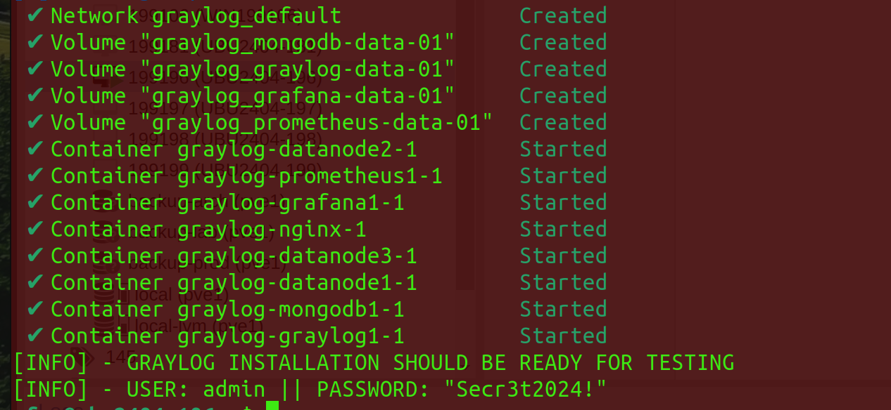

# Graylog Installation

## Install Ubuntu LTS

Create a virtual machine:

    - CPU Cores: at least 8
    - Memory: at least 32 GB
    - Storage: at least 480 GB
    - Operating System: Ubuntu LTS, Standard Setup without additional packages
    - Configured IP-Address, DNS resolution and Access to the Internet

Depending on your setup, you might want to add hypervisor-specific guest tools, potentially additional agents required by organizational policy.

## Install Graylog

Get the Installation Script and start from here:

```wget -q https://raw.githubusercontent.com/fjagwitz/Graylog-Cookbooks/main/01_Installation/install-graylog6-v1.sh && chmod +x install-graylog6-v1.sh && ./install-graylog6-v1.sh```



The system is accessible via

    - http://ipaddress
    - https://ipaddress (invalid certificate being used, you may change it after the installation)
    - http://fqdn
    - https://fqdn (invalid certificate being used, you may change it after the installation)

Nginx certificates are stored in the Ubuntu machine under ```/opt/graylog/nginx/ssl```