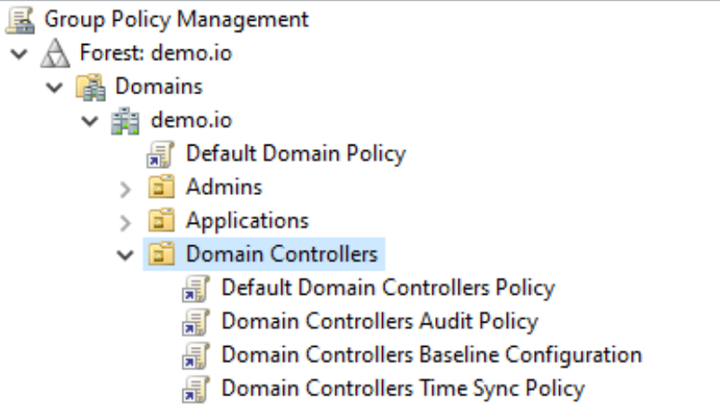

### Windows Audit Policy Collection

This Section contains preconfigured Audit Policies that have been created along the Microsoft Audit Policy Recommendations. We made a difference between Auditing Domain Controllers and Domain Member Servers, as these require different Audit Settings. 

Domain Controller Audit Policies should be linked with the Domain Controllers OU to properly control the Scope of the Audit Settings: 

Domain Member Server Audit Policies should be linked with one or more OUs being used for Device Management:

Links: 
- Microsoft Security Baselines Introduction: https://learn.microsoft.com/en-us/windows/security/operating-system-security/device-management/windows-security-configuration-framework/windows-security-baselines
- Microsoft Audit Policy Recommendations: https://learn.microsoft.com/en-us/windows-server/identity/ad-ds/plan/security-best-practices/audit-policy-recommendations
- Best Practices regarding Advanced Audit Policy: https://learn.microsoft.com/en-us/windows-server/identity/ad-ds/plan/security-best-practices/advanced-audit-policy-configuration
- Microsoft Security Baselines Blog: https://techcommunity.microsoft.com/category/security-baselines/blog/microsoft-security-baselines
- Security Compliance Toolkit: https://www.microsoft.com/en-us/download/details.aspx?id=55319