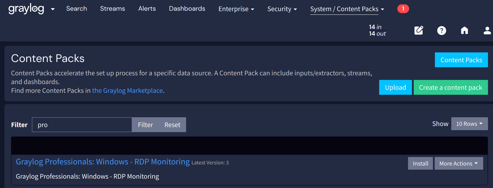

# Graylog Professionals: Windows - RDP Monitoring

## Requirements

- Graylog 6.0.2 or higher
- Graylog Enterprise or Security License
- Illuminate 5.1 or higher

## How to install

- Upload and [Install](https://graylog.org/videos/content-packs/) the Content Pack in Graylog (the video is for Graylog v3.0 but it does still work the same way)
- Go to _"SYSTEM" / "CONTENT PACKS"_ and filter for "pro": 
- test
