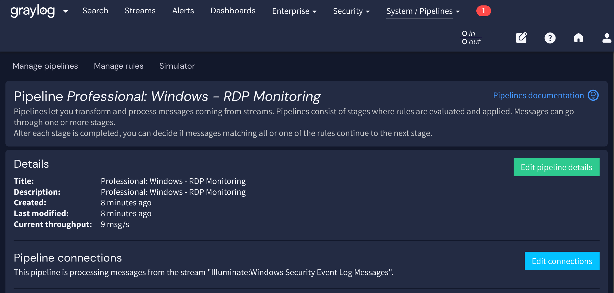
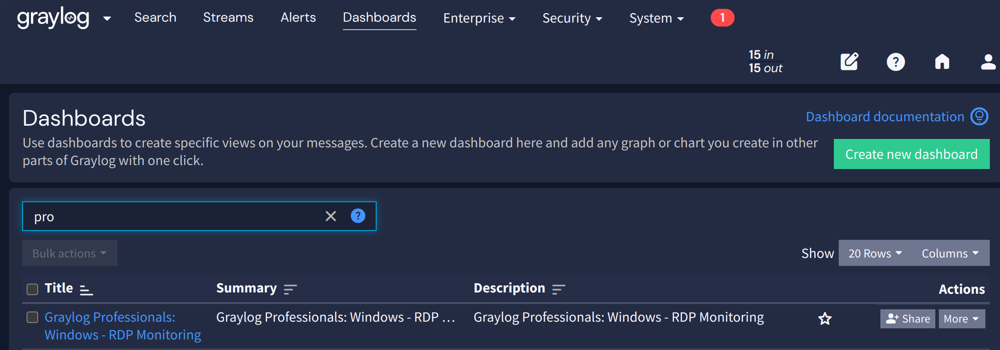

# Graylog Professionals: Windows - RDP Monitoring

## Requirements

- Graylog 6.0.2 or higher
- Graylog Enterprise or Security License
- Illuminate 5.1 or higher

## How to install

- Upload and [Install](https://graylog.org/videos/content-packs/) the Content Pack in Graylog (the video is for Graylog v3.0 but it does still work the same way)
- Go to _"SYSTEM" / "CONTENT PACKS"_, filter for "pro" and klick on "Install":
  
  
- Go to _"SYSTEM" / "PIPELINES"_, filter for "pro" and klick on "Edit":

  
- Klick on "Edit connections":
  
  
- Choose "Illuminate: Windows Security Event Log Messages" and "Update connections":

  
- Validate your settings and ensure the UI shows "This pipeline is processing messages from the stream "Illuminate:Windows Security Event Log Messages":
  
  
- Go to _"DASHBOARDS"_, filter for "pro" and choose __"Graylog Professionals: Windows - RDP Monitoring"__:

  
